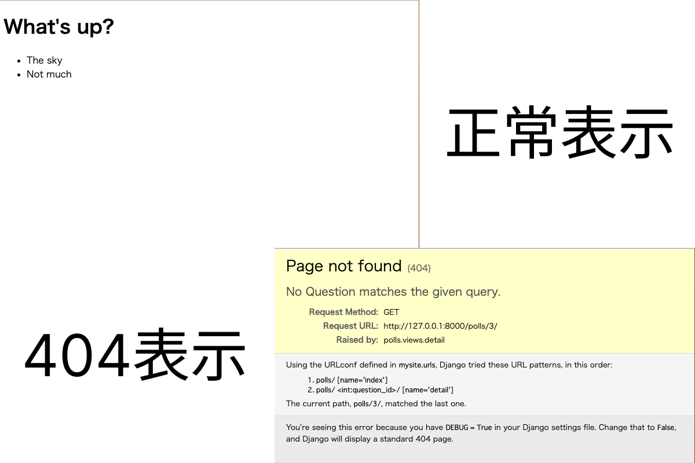

# Django チュートリアル 3

## 開始

- 2023/09

## 内容

- URLConf
- ビューが渡す HttpResponse の作り方
- HTML 　 templates
- 404 送出
- URL テンプレートタグ

## URLConf

誰かが Web サイトの「polls/34/」をリクエストすると，Django は ROOT_URLCONF に設定されている Python モジュールを<プロジェクト名>.urls(今回は mysite.urls)をロードする．そのモジュール内の urlpatterns という変数を探し，順番にパターンを検査していく．「polls/」にマッチした箇所を見つけたあと，一致した文字列を取り除き，残りの文字列である「34/」を次の「<アプリ名>.urls(今回は polls.urls)」の URLConf に渡す．これによって一致したものを表示する処理を行う．

```Python
path("<int:question_id>/", views.detail, name="detail"),
```

上記の<int:question_id>で URL パスの引数部分を記入する．

## ビューの役割

各ビューには，2 つの役割がある．1 つはリクエストされたページのコンテンツを含む「HttpResponse」オブジェクトを返すこと．もう一つは「Http404」のような例外の送出．
<br>
HttpResponse のオブジェクトを渡す方法

- (1)

```Python
from django.http import HttpResponse

return HttpResponse(template.render(context, request))
```

- (2)render()：第 1 引数(request オブジェクト)第 2 引数(テンプレート名)第 3 引数(任意)

```Python
from django.shortcuts import render

return render(request, "polls/index.html", context)
```

## templates ディレクトリ

ビューでページのデザインを記入するコーディングはよくないので，Django にあるテンプレートシステムを使ってビューから使用できるテンプレートを作成し，Python からデザインを分離する．プロジェクトの TEMPLATES には，Django がどのようにテンプレートをロードしレンダリングするかが書かれている．デフォルトの設定では，DjangoTemplates バックエンドが設定されており，その APP_DIR のオプションが True になっている．規約により DjangoTemplates は INSTALLED_APPS のそれぞれの templates サブディレクトリを検索する．

<br>
★templatesディレクトリの構成

```
polls
	├ templetes
	│     └ polls
	│        ├ index.html
	│        └ ・・・
	└ ・・・
```

<br>
※テンプレートの名前空間 <br>
テンプレートを直接「polls/templates」においてもいいのではないかとなるが，Djangoは名前がマッチした最初のテンプレートを使用するので，別のテンプレートをしようしてしまう可能性があるためです．

## エラーページの表示処理方法

- (1)try-except を使用した方法

```Python
from django.http import Http404

    try:
        question = Question.objects.get(pk=question_id)
    except Question.DoesNotExist:
        raise Http404("Question does not exist")
    return render(request, "polls/detail.html", {"question": question})
```

- (2) get_object_or_404()：get を実行してオブジェクトが存在しない場合は，Http404 を送出することはよく使われる．それをショートカット化したコード．第 1 引数に任意の引数をとり，オブジェクトが存在しないときは Http404 を表示します．

```Python
from django.shortcuts import get_object_or_404, render

question = get_object_or_404(Question, pk=question_id)
return render(request, "polls/detail.html", {"question": question})
```

get_list_or_404() という関数もあります．この関数は get_object_or_404() と同じように動きますが， get() ではなく，filter() を使います．リストが空の場合は Http404 を送出します．

- 下記のような 404 ページが表示されていたら大丈夫．
  

## URL テンプレートタグ

```HTML
<li><a href="/polls/{{ question.id }}/">{{ question.question_text }}</a></li>
<!-- 上記の書き方では，複数のURL変更があったとき面倒．なので} を使用してURL設定で定義されているURLパスへの依存をなくすことができる． -->
<li><a href="">{{ question.question_text }}</a></li>
```

しかし，上記だけの変更では，polls アプリと同じ，'detail' question.id を使っているものが存在したら判断がつかない．そのためにアプリの urls.py に名前空間(app_name)を追加してあげることで解決できる．

- polls/urls.py

```Python
# app_nameを追加する．
app_name = "polls"
urlpatterns = [
    path("", views.index, name="index"),
    path("<int:question_id>/", views.detail, name="detail"),
]
```

- polls/templates/polls/index.html

```
<li><a href="">{{ question.question_text }}</a></li>
```

上記のように変更することで解決できる．
